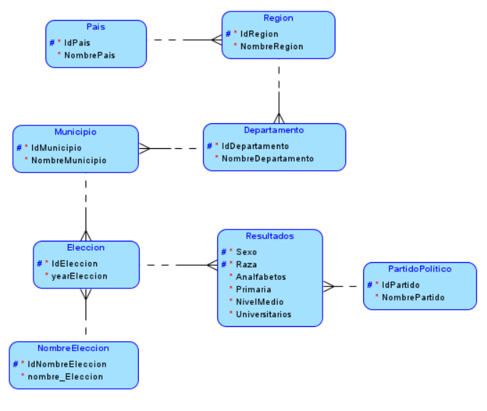
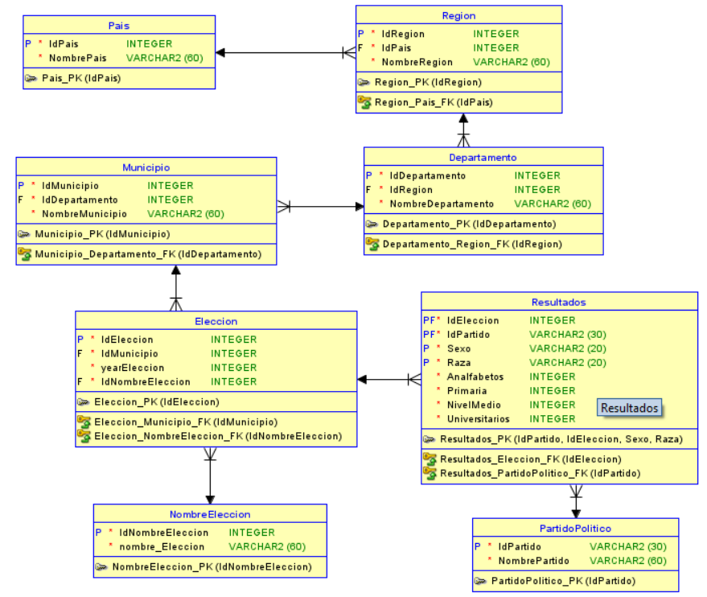

#### Universidad de San Carlos de Guatemala
#### Facultad de Ingenieria
#### Sistemas de bases de datos 1 Sección N
#### Catedratico:  Ing. Alvaro G. Longo M.  
 
<br><br><br><br><br><br><br>
<div style="text-align: center;">
  <span style="font-size: 34px;"><strong>Proyecto Grupo 3<br>Documentación de análisis</strong></span>
</div>
<br><br><br><br><br><br><br>


| Nombre Completo                     | Carnet    
| :---:                               |  :----:   
| Luis Antonio Cutzal Chalí           | 201700841
| Eduardo Alexander Reyez Gonzales    | 202010904
| Pedro Martín Francisco              | 201700656
| Camilo Ernesto Sincal Sipac         | 202000605

<br><br>

---
<br><br>

### Objetivos:
#### Objetivo General:
<p style="text-align: justify;">
Implemente un sistema de gestión de datos eficiente que le permita diseñar, desarrollar y mantener modelos relacionales, cargar grandes cantidades de datos en una plataforma dedicada y generar consultas SQL avanzadas para satisfacer sus necesidades de informes.
</p>

#### Objetivos Específicos

- Diseñar y desarrollar un modelo relacional a partir del planteamiento de un
problema y el análisis de un archivo de datos.
- Realizar una carga masiva de datos de la información proporcionada a una
nueva plataforma mediante la creación de una tabla temporal distribuyendo la
información de la carga al modelo relacional propuesto.
- Generar consultas avanzadas en lenguaje SQL que cumplan con los reportes
solicitados.

---
<br><br>

### Descripcion del Proyecto<br><br>

<p style="text-align: justify;">
El Instituto Centroamericano Electoral es una institución dedicada a registrar,
controlar y evaluar estadísticas de los comicios en los diferentes países de Centro
América, para lo cual requiere un sistema de bases de datos donde se puedan
hacer consultas de diferentes temas electorales.

</p>
<p style="text-align: justify;">
Los países están divididos en regiones. Cada región está formada por un conjunto
de departamentos o provincias, y cada provincia tiene un conjunto de municipios. A
cualquiera de estos (país, municipio, departamento o región) se le llama una zona.
Para la institución no es importante llevar información de los datos de los
ciudadanos, pues el voto es secreto. Sin embargo, es importante tener información
sobre las características generales de la población para tomar estadísticas respecto
al voto. Así, a la población se le puede clasificar de diferentes maneras,
dependiendo del tipo de información que la institución quiera saber. Por ejemplo, por
sexo: hombres, mujeres; por educación mínima: analfabetos, alfabetos; por raza:
indígenas, ladinos, garífunas, etc.; por escolaridad: primaria, nivel medio,
universitario; por edad: joven, adulto, tercera edad. Estos son solo ejemplos, pero la
institución puede dividir a los votantes de la forma que considere adecuada para
manejar información y tomar decisiones. De esta manera se puede saber si los
jóvenes, o las mujeres o los analfabetos votan más, en qué país, municipio,
departamento, etc. hay más votantes universitarios. Lo interesante, además, es que
se quiere llevar información de elecciones de diferentes años para hacer
comparaciones. En cada elección es importante el año y el tipo de elección o el
nombre que se le coloca en cada país. Por ejemplo, elecciones generales,
municipales, etc. del año 2007 en Guatemala.
</p>
<p style="text-align: justify;">
Cada elección tiene un conjunto de puestos de elección popular que se definen en
cada país y que abarcan una zona preestablecida (país, región, departamento o
municipio). Por ejemplo, un puesto de elección en Guatemala puede ser de alcalde
y por municipio, es decir, se eligen alcaldes para cada municipio. Otro puesto de
elección es el de presidente, pero éste es por país. La elección de diputados es
regional. La elección de gobernadores es departamental. Una elección puede tener
elecciones de diputados, presidentes, alcaldes, gobernadores, etc. De tal forma que
se vota por presidente en todo el país, pero para alcalde en cada municipio, así los
ciudadanos que votan por un alcalde en su municipio no pueden votar por alcalde
en otro municipio, por ejemplo..
</p>

<p style="text-align: justify;">
Los ciudadanos votan para un puesto de elección por candidatos que deben, por
ley, ser propuestos por partidos políticos o comités cívicos. De esta forma, los
partidos políticos participan para ser electos en cualquier puesto de elección que
quieran. Por ejemplo, el partido ABC participa en Guatemala, para elecciones de
presidente y diputados, otros partidos participarán en otros puestos de elección.
Esto es igual en todos los países. No es importante saber el nombre del candidato,
sino solamente del partido político en cada país, que participa en una elección
específica por un puesto de elección en una zona del país. Bajo este esquema, se
puede saber cuántos votos obtuvo un partido político en determinada elección para
determinado puesto de elección, en una zona dada y las características de los
votantes (raza, escolaridad, sexo, etc.).
</p>

_____

### Normalización<br><br>


<p style="text-align: justify;">
Como primer punto se identificaron las principales entidades involucradas en el sistema, como país, región, departamento, municipio, elección, partido político, y resultados de elecciones. 
</p>

<p style="text-align: justify;">
Se identificaron las relaciones entre las entidades, como la relación entre país y región, región y departamento, departamento y municipio, municipio y elección, elección y partido político, y elección y resultados de elecciones.
</p>


**Modelo lógico:** 
<p style="text-align: justify;">
Se creó un modelo lógico de la base de datos que representaba las entidades y relaciones.
</p>


<br><br>

<p style="text-align: justify;">
Se representaron los datos en forma de una estructura de base de datos de manera abstracta.
</p>

<p style="text-align: justify;">
Se ha confirmado que el modelo lógico captura correctamente los requisitos del sistema y refleja con precisión la estructura de la base de datos y las relaciones entre los objetos.
</p>


<p style="text-align: justify;">
Se eliminaron las redundancias de datos al dividir las entidades en tablas separadas y evitar la repetición de información. Por ejemplo, la información sobre países se almacena en una tabla aparte en lugar de repetirse en cada registro de municipio.
</p>

<p style="text-align: justify;">
Se crearon las tablas pais, region y departamento para representar estas entidades, dividiendo la información en tablas más pequeñas y asegurando que cada atributo dependa completamente de la clave primaria de su tabla respectiva. Por ejemplo, el nombre de un departamento depende completamente de la región a la que pertenece, lo que se refleja en la tabla departamento.
</p>

<p style="text-align: justify;">
Se creó la tabla resultados para manejar esta información, dividiendo la información en tablas más pequeñas y asegurando que no haya dependencias transitivas. Por ejemplo, las características de la población como el sexo y la raza dependen directamente de la elección y el partido político, lo que se refleja en la tabla resultados.
</p>

<p style="text-align: justify;">
Se han definido claves primarias en cada tabla para identificar de manera única cada registro y tambien se han definido claves foráneas para establecer relaciones entre las tablas, lo que asegura la integridad referencial entre ellas.
</p>

<p style="text-align: justify;">
Como se trabajo en el software: "data modeler" se utilizo la opcion llamda: Realizar ingenieria a modelo relacional, esto con el fin de poder tener el modelo relacional basandonos en el modelo logico.
</p>




<p style="text-align: justify;">
Cada tabla representa una entidad y contiene columnas que representan los atributos de esa entidad.
</p>

<p style="text-align: justify;">
Los atributos de cada entidad se reflejan como columnas en las respectivas tablas.
</p>

<p style="text-align: justify;">
Las relaciones entre las entidades se reflejan mediante el uso de claves foráneas en las tablas.
Por ejemplo, la tabla region tiene una columna idpais que actúa como clave foránea que se relaciona con la tabla pais, estableciendo así la relación entre regiones y países.
</p>

<p style="text-align: justify;">
Cada tabla tiene una clave primaria que identifica de manera única cada registro en esa tabla.
</p>
<p style="text-align: justify;">
Las claves foráneas se utilizan para establecer relaciones entre las diferentes tablas.
</p>

<p style="text-align: justify;">
Para finalizar, se exporto el modelo relacional con el fin de tener el script y poder implementarlo en un motor de base de datos ademas de agregar una tabla extra llamada temporal.
</p>

```sql
CREATE DATABASE PROYMAGIS;

USE PROYMAGIS;

CREATE TABLE tabla_temporal (
    NOMBRE_ELECCION VARCHAR(30),
    AÑO_ELECCION INT,
    PAIS VARCHAR(30),
    REGION VARCHAR(30),
    DEPTO VARCHAR(30),
    MUNICIPIO VARCHAR(60),
    PARTIDO VARCHAR(30),
    NOMBRE_PARTIDO VARCHAR(30),
    SEXO VARCHAR(20),
    RAZA VARCHAR(20),
    ANALFABETOS INT,
    ALFABETOS INT,
    PRIMARIA INT,
    NIVELMEDIO INT,
    UNIVERSITARIOS INT
);

CREATE TABLE pais (
    idpais     INT NOT NULL AUTO_INCREMENT,
    nombrepais VARCHAR(60) NOT NULL,
    PRIMARY KEY (idpais)
);

CREATE TABLE region (
    idregion     INT NOT NULL AUTO_INCREMENT,
    idpais       INT NOT NULL,
    nombreregion VARCHAR(60) NOT NULL,
    PRIMARY KEY (idregion),
    CONSTRAINT region_pais_fk FOREIGN KEY (idpais) REFERENCES pais (idpais)
);

CREATE TABLE departamento (
    iddepartamento     INT NOT NULL AUTO_INCREMENT,
    idregion           INT NOT NULL,
    nombredepartamento VARCHAR(60) NOT NULL,
    PRIMARY KEY (iddepartamento),
    CONSTRAINT departamento_region_fk FOREIGN KEY (idregion) REFERENCES region (idregion)
);

CREATE TABLE municipio (
    idmunicipio     INT NOT NULL AUTO_INCREMENT,
    iddepartamento  INT NOT NULL,
    nombremunicipio VARCHAR(60) NOT NULL,
    PRIMARY KEY (idmunicipio),
    CONSTRAINT municipio_departamento_fk FOREIGN KEY (iddepartamento) REFERENCES departamento (iddepartamento)
);

CREATE TABLE nombreeleccion (
    idnombreeleccion INT NOT NULL AUTO_INCREMENT,
    nombre_eleccion  VARCHAR(60) NOT NULL,
    PRIMARY KEY (idnombreeleccion)
);

CREATE TABLE eleccion (
    ideleccion       INT NOT NULL AUTO_INCREMENT,
    idmunicipio      INT NOT NULL,
    yeareleccion     INT NOT NULL,
    idnombreeleccion INT NOT NULL,
    PRIMARY KEY (ideleccion),
    CONSTRAINT eleccion_municipio_fk FOREIGN KEY (idmunicipio) REFERENCES municipio (idmunicipio),
    CONSTRAINT eleccion_nombreeleccion_fk FOREIGN KEY (idnombreeleccion) REFERENCES nombreeleccion (idnombreeleccion)
);

CREATE TABLE partidopolitico (
    idpartido     VARCHAR(30) NOT NULL,
    nombrepartido VARCHAR(60) NOT NULL,
    PRIMARY KEY (idpartido)
);


CREATE TABLE resultados (
    ideleccion     INT NOT NULL,
    idpartido      VARCHAR(30) NOT NULL,
    sexo           VARCHAR(20) NOT NULL,
    raza           VARCHAR(20) NOT NULL,
    analfabetos    INT NOT NULL,
    primaria       INT NOT NULL,
    nivelmedio     INT NOT NULL,
    universitarios INT NOT NULL,
    PRIMARY KEY (ideleccion,idpartido,sexo,raza),
    CONSTRAINT resultados_eleccion_fk FOREIGN KEY (ideleccion) REFERENCES eleccion (ideleccion),
    CONSTRAINT resultados_partidopolitico_fk FOREIGN KEY (idpartido) REFERENCES partidopolitico (idpartido)
);
```

<p style="text-align: justify;">
En el enunciado se menciona que se requiere un sistema de bases de datos donde se puedan hacer consultas de diferentes temas electorales. Para lograr esto, se creó la tabla tabla_temporal
</p>

______